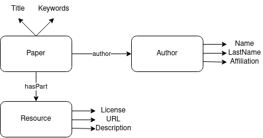

## Morph KGC example project

This sample project may help you organize your data and mappings for morph-kgc.

### Pre-requisites
Install [morph-kgc](https://github.com/oeg-upm/morph-kgc)

### Example project
The `configuration.ini` contains the paths to the mappings and datasets to process. Once you have set them up, simply run morph-kgc with the following command:

`python3 -m morph_kgc configuration_example.ini`

Right now, the output is written into an `out.ttl` file.

The current example depicts a simple representation for authors, papers and resources from three different CSVs (with paper information, author information and resource information, respectively). The main property and class diagram relating all three is depicted below:

